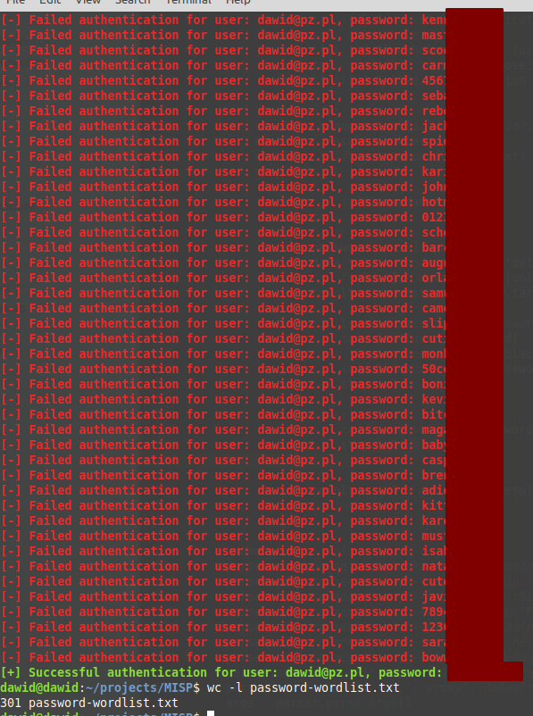

# MISP - Malware Information Sharing Platform
## Bruteforce protection not working in very specific environments

|  |  |
|---|---|
| **Vulnerability** | Bruteforce protection not working in very specific environments | 
| **Vendor** | CIRCL (Open Source) |
| **Product** | MISP - Malware Information Sharing Platform & Open Standards For Threat Information Sharing - https://www.misp-project.org/ |
| **Vulnerable version** | 2.4.120 |
| **Fixed version** | 2.4.121 |
| **CVE** | CVE-2020-8890 |
| **CVSS Score** | 3.7 Low |
| **CVSS Vector** | CVSS:3.0/AV:N/AC:H/PR:N/UI:N/S:U/C:L/I:N/A:N |

## References
* https://www.misp-project.org/2020/02/12/MISP.2.4.121.released.html
* https://github.com/MISP/MISP/commit/934c82819237b4edf1da64587b72a87bec5dd520
* https://github.com/MISP/MISP/commit/c1a0b3b2809b21b4df8c1efbc803aff700e262c3
* https://nvd.nist.gov/vuln/detail/CVE-2020-8890

## Description
Brute force protection is not working when database time is at least one hour ahead of the web server time. It can also happen if a web server and a database are in different timezones.  
A malicious user could perform a brute force attack against a valid user account of the application. The application did not restrict the number of password attempts, or lock the user account to prevent this type of attack in specific environments.  

### PoC
To prepare proof of concept MISP instance, set your web server timezone one hour ahead of the database timezone.

Run the following replacing parameters accordingly:
```bash
python bruteforce-exploit.py --target http://localhost --user dawid@pz.pl --passwords passwords.txt --insecure --verbose
```

The following screenshot illustrates successful bruteforce attack:

